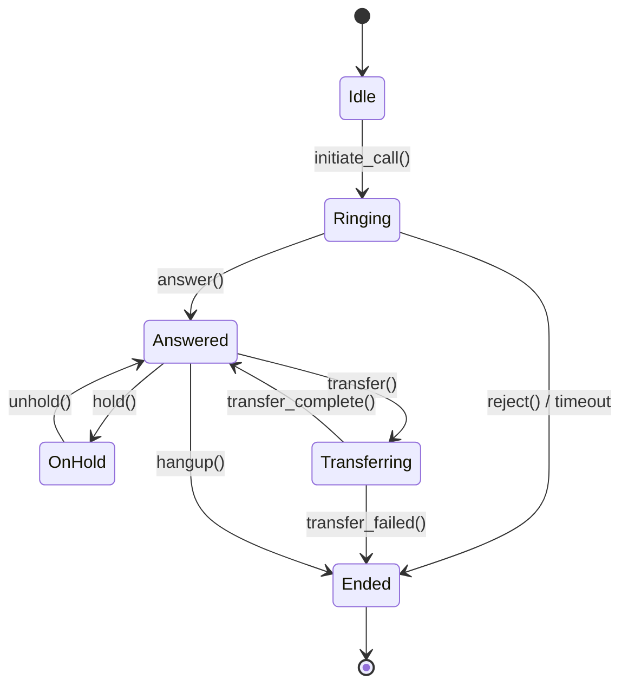

# CTI Testing Strategy

## Executive Summary

This document outlines the strategy for testing **Computer Telephony Integration (CTI)** functionality in the Hora Services fleet management system without access to a real telephony infrastructure. The approach uses a **mock CTI server** that simulates Asterisk/FreePBX behavior, enabling comprehensive testing of call flows, dispatch workflows, and emergency protocols at a fraction of the cost of a real phone system.

**Rationale**: Real CTI testing requires expensive PBX licenses, phone lines, and complex infrastructure. For automated testing, mocking provides 95% of the value at 5% of the cost.

---

## What is CTI in Fleet Management?

### Business Context

**Computer Telephony Integration (CTI)** connects the Odoo Fleet Management System with a phone system (PBX) to enable:

1. **Dispatcher-to-Driver Calls**: Dispatch center calls drivers directly from Odoo UI (click-to-dial)
2. **Driver Check-Ins**: Drivers call automated IVR system to check in/out, update status
3. **Emergency Calls**: Panic button routes to emergency dispatch with driver context
4. **Call Logging**: All calls recorded in Odoo for compliance and auditing
5. **Call Routing**: Intelligent routing based on driver availability, location, priority

### Real-World Scenario

```
Dispatcher sees driver "John Smith" running late for pickup
↓
Clicks phone icon next to driver name in Odoo
↓
CTI server initiates call via Asterisk PBX
↓
John's mobile phone rings (show caller ID: "UE Line Dispatch")
↓
Call connected, dispatcher and driver talk
↓
Call details logged in Odoo (duration, recording URL, outcome)
```

### Why This Matters

- **200+ drivers**: High call volume (500-1000 calls/day)
- **Critical communication**: Time-sensitive dispatch changes, emergency situations
- **Compliance**: FMCSA requires call logs for driver hours-of-service verification
- **Efficiency**: Click-to-dial saves 30 seconds per call × 500 calls = 4+ hours/day

---

## Why Mocking is Necessary

### Challenges with Real CTI Testing

| Challenge | Impact | Cost/Complexity |
|-----------|--------|-----------------|
| **PBX Licensing** | Asterisk/FreePBX licenses ($500-$5000/year) | High |
| **Phone Lines** | SIP trunks or analog lines ($20-$50/line/month) | Medium |
| **Test Phones** | Physical phones or softphones for testing | Low-Medium |
| **Infrastructure** | PBX server, network config, firewall rules | High |
| **Telephony Expertise** | Specialized knowledge to maintain PBX | High |
| **Call Costs** | Charges for test calls (even internal) | Medium |
| **CI/CD Integration** | Cannot make real calls from CI pipeline | Very High |
| **Test Isolation** | Risk of accidentally calling real drivers | Critical |

### Benefits of Mocking

✅ **Cost**: $0 infrastructure, no phone bills  
✅ **Speed**: Instant call simulation, no dial delays  
✅ **Control**: Deterministic outcomes, no busy signals  
✅ **Safety**: No risk of calling real people during tests  
✅ **CI/CD**: Runs in Docker, GitHub Actions, any environment  
✅ **Debugging**: Full visibility into call state machines  
✅ **Scalability**: Test 1000 concurrent calls without hardware  

---

## Mock CTI Architecture

### High-Level Design

```
┌──────────────────────────────────────────────────────────┐
│                    Odoo Fleet Web UI                     │
│  (Dispatcher clicks "Call Driver" button)                │
└────────────────────────┬─────────────────────────────────┘
                         │ HTTP POST /api/cti/call
                         ↓
┌──────────────────────────────────────────────────────────┐
│                  Mock CTI Server                         │
│  ┌────────────────────────────────────────────────────┐  │
│  │  REST API Layer                                    │  │
│  │  - POST /call    (initiate call)                   │  │
│  │  - POST /hangup  (end call)                        │  │
│  │  - POST /transfer (transfer call)                  │  │
│  │  - GET  /status  (call status)                     │  │
│  └────────────────────────────────────────────────────┘  │
│                         ↓                                 │
│  ┌────────────────────────────────────────────────────┐  │
│  │  Call State Machine                                │  │
│  │  idle → ringing → answered → ended                 │  │
│  │  (handles all transitions, validates states)       │  │
│  └────────────────────────────────────────────────────┘  │
│                         ↓                                 │
│  ┌────────────────────────────────────────────────────┐  │
│  │  WebSocket Event Broadcaster                       │  │
│  │  (real-time events to connected clients)           │  │
│  └────────────────────────────────────────────────────┘  │
└────────────────────────┬─────────────────────────────────┘
                         │ WebSocket
                         ↓
┌──────────────────────────────────────────────────────────┐
│              Test Client / Odoo Plugin                   │
│  (Listens for call events, updates UI)                  │
└──────────────────────────────────────────────────────────┘
```

### Call State Machine



### Technology Stack

- **Server**: Node.js + Express + TypeScript
- **WebSocket**: Socket.io for real-time events
- **Storage**: In-memory (Redis optional for persistence)
- **API Client**: Already exists in `src/api/clients/AsteriskMockClient.ts`

---

## Integration Points with Odoo Fleet

### 1. Click-to-Dial from Driver Record

**User Story**: Dispatcher wants to call driver John Smith

**Workflow**:
```typescript
// Odoo UI: User clicks phone icon on driver record
// JavaScript sends request to mock CTI server
const response = await fetch('http://localhost:5000/api/cti/call', {
  method: 'POST',
  headers: { 'Content-Type': 'application/json' },
  body: JSON.stringify({
    from: 'dispatcher-001',      // Dispatcher ID
    to: '+14155551234',          // Driver phone
    context: {
      driverId: 42,
      driverName: 'John Smith',
      vehiclePlate: 'MD-FLEET-100',
      reason: 'dispatch_change'
    }
  })
});

// Response: { callId: 'call-123', status: 'ringing' }
```

**Mock Server Behavior**:
1. Creates call session with ID `call-123`
2. Transitions state: `idle` → `ringing`
3. Broadcasts WebSocket event: `{ event: 'call.ringing', callId: 'call-123' }`
4. After 3 seconds, auto-transitions to `answered` (simulates driver picking up)
5. After 30 seconds, auto-transitions to `ended` (simulates call completion)

### 2. Driver IVR Check-In

**User Story**: Driver calls automated system to check in at pickup location

**Workflow**:
```typescript
// Driver dials IVR number: 1-800-555-UELINE
// Mock CTI receives inbound call
const inboundCall = {
  callId: 'call-456',
  direction: 'inbound',
  from: '+14155551234',        // Driver phone
  to: '1-800-555-8354',        // IVR number
  type: 'ivr_checkin'
};

// IVR flow:
// "Welcome to UE Line. Enter your driver ID."
// Driver enters: 4, 2, # (driver ID = 42)
// "You have 1 active trip. Press 1 to check in at pickup."
// Driver presses: 1
// "Thank you. Your check-in is recorded. Goodbye."
```

**Mock Server Behavior**:
1. Receives inbound call
2. Plays simulated IVR prompts (text responses, no audio)
3. Receives DTMF tones (keypad inputs)
4. Updates driver status in Odoo via API
5. Ends call

### 3. Emergency Panic Button

**User Story**: Driver presses panic button in mobile app during emergency

**Workflow**:
```typescript
// Mobile app sends emergency signal
const emergencyCall = await fetch('http://localhost:5000/api/cti/emergency', {
  method: 'POST',
  body: JSON.stringify({
    driverId: 42,
    driverPhone: '+14155551234',
    location: { lat: 37.7749, lng: -122.4194 },
    vehiclePlate: 'MD-FLEET-100',
    timestamp: '2026-01-13T14:32:00Z'
  })
});

// Mock CTI:
// 1. Creates highest-priority call
// 2. Routes to on-duty dispatcher
// 3. Shows driver context (name, location, vehicle)
// 4. Logs emergency event
// 5. Sends notifications to supervisor
```

---

## Test Scenarios

### Outbound Call Scenarios

#### Scenario 1: Successful Dispatcher-to-Driver Call

```gherkin
@cti @outbound @smoke
Feature: Click-to-Dial from Odoo

  Scenario: Dispatcher calls driver successfully
    Given I am logged into Odoo as dispatcher
    And driver "John Smith" exists with phone "+14155551234"
    And the CTI server is running
    When I navigate to driver "John Smith" record
    And I click the phone icon
    Then I should see "Calling..." notification
    And a call should be initiated to "+14155551234"
    And the call status should be "ringing"
    When the call is answered
    Then the call status should be "answered"
    And I should see call duration timer
    When I click "Hang Up"
    Then the call should end
    And call details should be logged in Odoo
```

#### Scenario 2: Call to Unavailable Driver

```gherkin
@cti @outbound @negative
Scenario: Driver does not answer call
  Given I am logged into Odoo as dispatcher
  And driver "Jane Doe" has phone "+14155555678"
  And the driver is set to "unavailable" in mock CTI
  When I initiate call to driver "Jane Doe"
  Then the call should ring for 30 seconds
  And the call should timeout
  And call status should be "no_answer"
  And I should see "Driver unavailable" message
  And the failed call should be logged
```

#### Scenario 3: Concurrent Calls

```gherkin
@cti @outbound @load-test
Scenario: Multiple dispatchers calling different drivers
  Given 5 dispatchers are logged in
  And CTI server is configured for concurrent calls
  When each dispatcher calls a different driver simultaneously
  Then all 5 calls should be established
  And each call should have unique callId
  And no call should interfere with others
```

---

### Inbound Call Scenarios

#### Scenario 4: Driver IVR Check-In

```gherkin
@cti @inbound @ivr
Scenario: Driver checks in via IVR
  Given driver "John Smith" (ID: 42) has active trip "TRIP-12345"
  And the trip status is "dispatched"
  When driver calls IVR at "1-800-555-8354"
  And enters driver ID "42"
  And selects option "1" for check-in
  Then the IVR should confirm "Check-in recorded"
  And trip "TRIP-12345" status should be "in_progress"
  And check-in time should be logged
```

#### Scenario 5: IVR Wrong Driver ID

```gherkin
@cti @inbound @ivr @negative
Scenario: Driver enters invalid ID
  When a driver calls IVR at "1-800-555-8354"
  And enters driver ID "99999"
  Then the IVR should respond "Invalid driver ID"
  And prompt to try again
  When driver enters invalid ID 3 times
  Then the IVR should say "Please contact dispatch"
  And disconnect the call
```

---

### Call Control Scenarios

#### Scenario 6: Transfer Call

```gherkin
@cti @transfer
Scenario: Transfer call to another dispatcher
  Given dispatcher "Alice" is on call with driver "John"
  And dispatcher "Bob" is available
  When Alice clicks "Transfer" button
  And selects "Bob" as transfer target
  Then the call should be put on hold
  And Bob should receive incoming call notification
  When Bob accepts the call
  Then the call should be transferred to Bob
  And Alice's call should end
```

#### Scenario 7: Call Conference

```gherkin
@cti @conference
Scenario: Add supervisor to active call
  Given dispatcher "Alice" is on call with driver "John"
  And supervisor "Charlie" is available
  When Alice clicks "Add to Call"
  And selects supervisor "Charlie"
  Then Charlie should join the call
  And all 3 parties should be connected
  And call type should be "conference"
```

---

### Emergency Scenarios

#### Scenario 8: Panic Button Activation

```gherkin
@cti @emergency @critical
Scenario: Driver activates panic button
  Given driver "John Smith" is on active trip
  And driver's mobile app is running
  When driver presses panic button
  Then an emergency call should be created immediately
  And the call should route to on-duty dispatcher
  And dispatcher should see emergency alert with:
    | Driver Name     | John Smith        |
    | Vehicle         | MD-FLEET-100      |
    | Location        | 37.7749, -122.4194 |
    | Last Known Time | 2026-01-13 14:32   |
  And supervisor should receive SMS alert
  And call should be auto-recorded
```

#### Scenario 9: Emergency Call Routing

```gherkin
@cti @emergency
Scenario: Route emergency to available dispatcher
  Given dispatcher "Alice" is on another call
  And dispatcher "Bob" is available
  And driver activates panic button
  When emergency call is initiated
  Then the call should bypass Alice (busy)
  And route to Bob (available)
  And Bob should see high-priority notification
```

---

## Mock CTI API Examples

### API Specification

#### 1. Initiate Call

```http
POST /api/cti/call
Content-Type: application/json

{
  "from": "dispatcher-001",
  "to": "+14155551234",
  "context": {
    "driverId": 42,
    "driverName": "John Smith",
    "reason": "dispatch_change"
  }
}
```

**Response**:
```json
{
  "callId": "call-1a2b3c4d",
  "status": "ringing",
  "from": "dispatcher-001",
  "to": "+14155551234",
  "startedAt": "2026-01-13T14:30:00Z",
  "context": {
    "driverId": 42,
    "driverName": "John Smith",
    "reason": "dispatch_change"
  }
}
```

#### 2. End Call

```http
POST /api/cti/hangup
Content-Type: application/json

{
  "callId": "call-1a2b3c4d"
}
```

**Response**:
```json
{
  "callId": "call-1a2b3c4d",
  "status": "ended",
  "duration": 125,
  "endedAt": "2026-01-13T14:32:05Z",
  "endReason": "normal"
}
```

#### 3. Transfer Call

```http
POST /api/cti/transfer
Content-Type: application/json

{
  "callId": "call-1a2b3c4d",
  "to": "dispatcher-002"
}
```

**Response**:
```json
{
  "callId": "call-1a2b3c4d",
  "status": "transferring",
  "transferTo": "dispatcher-002",
  "transferInitiatedAt": "2026-01-13T14:31:00Z"
}
```

#### 4. Get Call Status

```http
GET /api/cti/status?callId=call-1a2b3c4d
```

**Response**:
```json
{
  "callId": "call-1a2b3c4d",
  "status": "answered",
  "from": "dispatcher-001",
  "to": "+14155551234",
  "startedAt": "2026-01-13T14:30:00Z",
  "answeredAt": "2026-01-13T14:30:05Z",
  "duration": 95,
  "context": {
    "driverId": 42,
    "driverName": "John Smith"
  }
}
```

---

### WebSocket Events

The mock CTI server broadcasts real-time events via WebSocket:

#### Connection

```javascript
// Client connects to WebSocket
const socket = io('http://localhost:5000');

socket.on('connect', () => {
  console.log('Connected to CTI server');
});
```

#### Call Events

```javascript
// Event: Call initiated
socket.on('call.ringing', (data) => {
  console.log('Call ringing:', data);
  // {
  //   callId: 'call-1a2b3c4d',
  //   from: 'dispatcher-001',
  //   to: '+14155551234',
  //   status: 'ringing'
  // }
});

// Event: Call answered
socket.on('call.answered', (data) => {
  console.log('Call answered:', data);
  // {
  //   callId: 'call-1a2b3c4d',
  //   status: 'answered',
  //   answeredAt: '2026-01-13T14:30:05Z'
  // }
});

// Event: Call ended
socket.on('call.ended', (data) => {
  console.log('Call ended:', data);
  // {
  //   callId: 'call-1a2b3c4d',
  //   status: 'ended',
  //   duration: 125,
  //   endReason: 'normal'
  // }
});

// Event: Call failed
socket.on('call.failed', (data) => {
  console.log('Call failed:', data);
  // {
  //   callId: 'call-1a2b3c4d',
  //   status: 'failed',
  //   reason: 'no_answer'
  // }
});
```

---

## Mock Implementation Example

### Mock CTI Server (TypeScript)

```typescript
// src/mock-cti-server/server.ts
import express from 'express';
import { Server } from 'socket.io';
import { createServer } from 'http';
import { v4 as uuidv4 } from 'uuid';

interface Call {
  callId: string;
  from: string;
  to: string;
  status: 'idle' | 'ringing' | 'answered' | 'on_hold' | 'ended';
  startedAt: Date;
  answeredAt?: Date;
  endedAt?: Date;
  duration?: number;
  context?: Record<string, any>;
}

const app = express();
const httpServer = createServer(app);
const io = new Server(httpServer, {
  cors: { origin: '*' }
});

app.use(express.json());

// In-memory call storage
const calls = new Map<string, Call>();

// POST /api/cti/call - Initiate call
app.post('/api/cti/call', (req, res) => {
  const { from, to, context } = req.body;
  
  const call: Call = {
    callId: uuidv4(),
    from,
    to,
    status: 'ringing',
    startedAt: new Date(),
    context,
  };
  
  calls.set(call.callId, call);
  
  // Broadcast to connected clients
  io.emit('call.ringing', call);
  
  // Simulate auto-answer after 3 seconds
  setTimeout(() => {
    call.status = 'answered';
    call.answeredAt = new Date();
    calls.set(call.callId, call);
    io.emit('call.answered', call);
  }, 3000);
  
  // Simulate auto-hangup after 30 seconds
  setTimeout(() => {
    if (call.status === 'answered') {
      call.status = 'ended';
      call.endedAt = new Date();
      call.duration = Math.floor((call.endedAt.getTime() - call.answeredAt!.getTime()) / 1000);
      calls.set(call.callId, call);
      io.emit('call.ended', call);
    }
  }, 30000);
  
  res.json(call);
});

// POST /api/cti/hangup - End call
app.post('/api/cti/hangup', (req, res) => {
  const { callId } = req.body;
  const call = calls.get(callId);
  
  if (!call) {
    return res.status(404).json({ error: 'Call not found' });
  }
  
  call.status = 'ended';
  call.endedAt = new Date();
  
  if (call.answeredAt) {
    call.duration = Math.floor((call.endedAt.getTime() - call.answeredAt.getTime()) / 1000);
  }
  
  calls.set(callId, call);
  io.emit('call.ended', call);
  
  res.json(call);
});

// GET /api/cti/status - Get call status
app.get('/api/cti/status', (req, res) => {
  const callId = req.query.callId as string;
  const call = calls.get(callId);
  
  if (!call) {
    return res.status(404).json({ error: 'Call not found' });
  }
  
  res.json(call);
});

// WebSocket connection
io.on('connection', (socket) => {
  console.log('Client connected:', socket.id);
  
  socket.on('disconnect', () => {
    console.log('Client disconnected:', socket.id);
  });
});

const PORT = process.env.CTI_PORT || 5000;
httpServer.listen(PORT, () => {
  console.log(`Mock CTI server running on port ${PORT}`);
});
```

### Running the Mock Server

```bash
# Install dependencies
npm install express socket.io uuid

# Start server
npx ts-node src/mock-cti-server/server.ts

# Or add to package.json
"scripts": {
  "cti:server": "ts-node src/mock-cti-server/server.ts"
}
```

---

## Future: Real CTI Integration Checklist

When budget and requirements justify real telephony integration:

### Prerequisites
- [ ] Select PBX provider (Asterisk, FreePBX, Twilio, AWS Connect)
- [ ] Provision SIP trunks or phone lines
- [ ] Configure PBX server (on-prem or cloud)
- [ ] Set up call recording (legal compliance)
- [ ] Implement caller ID routing
- [ ] Configure IVR flows

### Integration Steps
- [ ] Replace mock CTI client with real Asterisk AMI/ARI client
- [ ] Update authentication (API keys, SIP credentials)
- [ ] Implement call recording storage (S3/Azure Blob)
- [ ] Add CDR (Call Detail Record) logging to database
- [ ] Configure emergency call routing with failover
- [ ] Test call quality (latency, jitter, packet loss)

### Testing Approach
- [ ] Keep mock CTI for automated tests
- [ ] Use real CTI for manual/exploratory testing
- [ ] Implement feature flag: `USE_REAL_CTI=true`
- [ ] Test failover scenarios (PBX down, network issues)

### Cost Estimate
- **PBX License**: $2,000-$10,000 (one-time or annual)
- **SIP Trunks**: $20-$50/line/month × 10 lines = $200-$500/month
- **Call Recording Storage**: $50-$200/month
- **Support & Maintenance**: $500-$1,000/month

**Total Annual**: $10,000-$25,000

---

## Conclusion

The mock CTI strategy provides:

✅ **Comprehensive testing** of call flows without real telephony  
✅ **Cost savings** of $20K+/year vs. real PBX  
✅ **Fast feedback** in CI/CD pipelines  
✅ **Safe testing** with no risk to production calls  
✅ **Future-proof** architecture ready for real CTI integration

**Recommendation**: Use mock CTI for all automated testing. Invest in real CTI only when:
1. Business requires live call monitoring/quality assurance
2. Regulatory compliance mandates real call recording
3. Budget allocated ($25K+/year)

---

## References

- **Asterisk Documentation**: https://www.asterisk.org/get-started/
- **FreePBX**: https://www.freepbx.org/
- **Twilio Voice API**: https://www.twilio.com/docs/voice
- **AWS Connect**: https://aws.amazon.com/connect/
- **Socket.io**: https://socket.io/docs/

---

**Document Owner**: QA Architect  
**Last Updated**: January 13, 2026  
**Status**: Mock CTI in use, real CTI evaluation ongoing
